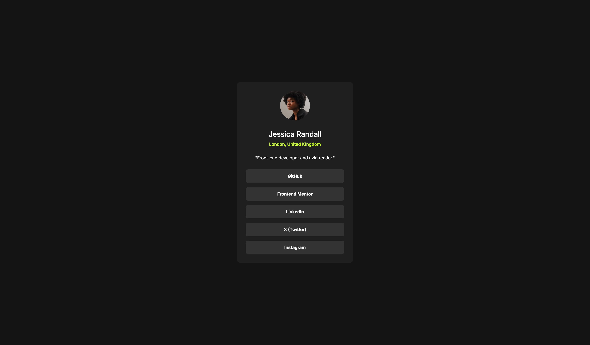
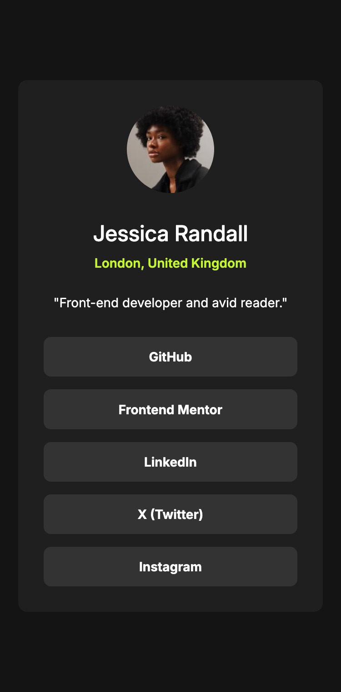

# Frontend Mentor - Social links profile solution

This is a solution to the [Social links profile challenge on Frontend Mentor](https://www.frontendmentor.io/challenges/social-links-profile-UG32l9m6dQ). Frontend Mentor challenges help you improve your coding skills by building realistic projects. 

## Table of contents

- [Overview](#overview)
  - [Screenshot](#screenshot)
  - [Links](#links)
- [My process](#my-process)
  - [Built with](#built-with)
  - [What I learned](#what-i-learned)
  - [AI Collaboration](#ai-collaboration)
- [Author](#author)

## Overview

### Screenshot

### Links

- Solution URL: [Solution at GitHub Repository](https://github.com/nazgrimm/social-links-card)
- Live Site URL: [Live Site with GitHub](https://nazgrimm.github.io/social-links-card)

## My process

### Built with

- Semantic HTML5 markup
- CSS custom properties
- Flexbox
- Google Fonts
- REM to PX calculator

### What I learned

- In this challenge, I put my visual skills to the test to judge how the containers and, above all, the text in the project look.
- I learned how to use aria-label so that screen readers can better guide the user. I also learned how to use <ul> and <li> after researching the correct way to use <nav>.
- In CSS, everything has been fairly standard, but this time, to get more exact numbers, I used a rem-to-pixel calculator for greater precision. I also applied the use of :last-of-type, which is very useful for removing margins from the last elements, and I practiced better use of :hover.

### AI Collaboration

- What tools: Claude (claude.ai); I used the AGENTS.md file provided by Frontend Mentor. This time, I didn't use it much, I mostly used it to get a sense of the concepts but I relied primarily on MDN.
- How: The focus was mainly on questions, not direct answers; Claude has taught me to think critically and use my own judgment rather than just giving me solutions.
- What worked: learning by thinking things through, not by copying. What didn't: sometimes I just wanted the quick answer 😄

## Author

- GitHub - [Nazgrim](https://github.com/nazgrimms)
- Frontend Mentor - [@nazgrimm](https://www.frontendmentor.io/profile/nazgrimm)
